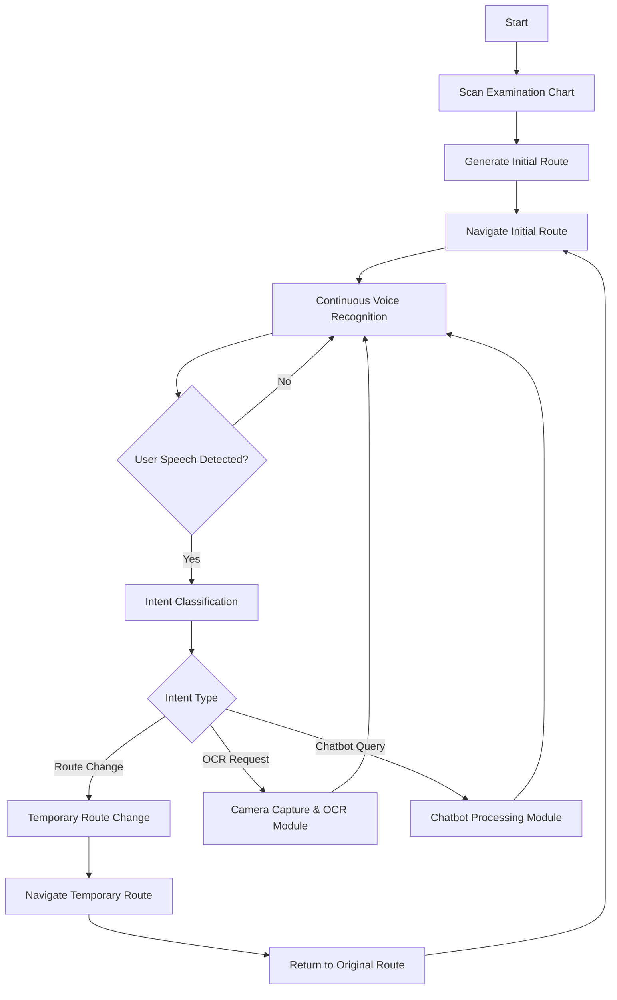

# Project ABC
<div align="center" style="display: flex; gap: 10px;">
  
  
</div>

<div align="center">
  <h2>의료 현장의 정보 약자와 동행하는 Medi-Buddy</h2>
</div>

### 🏥 복잡한 병원을 우리집처럼
* 미로 같이 복잡한 병원에서 길을 잃어버린 적이 있으신가요?
* 길을 묻기 미안했다면 Medi-Buddy가 안내해드릴게요
### 💊 어려운 의료 용어를 눈높이에 맞게
* 설명은 들어도 모르겠고 글씨는 왜 이렇게 작은지, 답답한 일이 많아요
* Medi-Buddy는 쉬운 해석과 함께 음성 설명을 제공합니다
### 🫂 말하기 힘든 정서 지원까지
* 몸도 아픈데 마음도 아프면 더 힘들어요
* 따뜻한 마음을 배운 Medi-Buddy가 당신 옆에 있을게요

<div align="center">
  <h2>STACK</h2>
</div>
<div align=center> 


</br>


</div>

------

# Minimum Viable Product
<div align="center">
  <h2>자율 주행</h2>
</div>

* SLAM을 기반으로 한 공간 매핑 자동화
* 경로 알고리즘 NAV2 구현
* 객체인식을 통한 장애물 탐지와 회피 후 경로 복귀
* 사용자 음성 기반 임시 경로 적용

<div align="center">
  <h2>AI 활용 서비스</h2>
</div>

* 음성을 통한 자연어 기반 VUI 구현
* OCR로 수집한 약제 정보를 이해하기 쉬운 말로 해석
* 파인튜닝 및 프롬프트 엔지니어링으로 최적화한 LLM 모델로 정서 상담 구현 및 환자별 상담 데이터베이스 구축

## High Level Design

<!--* (프로젝트 아키텍쳐 기술, 전반적인 diagram 으로 설명을 권장)-->

---
# How to Set

## Clone code

```shell
git clone https://github.com/Che-Serene/Medi-Buddy
```

## Prerequite

<!--* (프로잭트를 실행하기 위해 필요한 dependencies 및 configuration들이 있다면, 설치 및 설정 방법에 대해 기술)-->

```shell
python -m venv .venv
source .venv/bin/activate
pip install -r requirements.txt
```

## Steps to build

<!--* (프로젝트를 실행을 위해 빌드 절차 기술)-->

```shell
cd ~/xxxx
source .venv/bin/activate

make
make install
```

## Steps to run

<!--* (프로젝트 실행방법에 대해서 기술, 특별한 사용방법이 있다면 같이 기술)-->

```shell
cd ~/xxxx
source .venv/bin/activate
export OPENAI_API_KEY="sk-YOUR_OPENAI_API_KEY"

cd /path/to/repo/xxx/
python demo.py -i xxx -m yyy -d zzz
```

## Output

<!--* (프로젝트 실행 화면 캡쳐)-->


## Appendix

<!--* (참고 자료 및 알아두어야할 사항들 기술)-->

## Members
  | Name | Role |
  |----|----|
  | 채서린 | **PM/SW**, 만나서 반가웠고 싸우지 말자 |
  | 박현욱 | **HW**, 프로젝트 끝날 때까지 출국금지 |
  | 염한결 | **HW**, 500% 이해할 때까지 금연?금?주???? |
  | 정지아 | **SW**, 잡도리 퀸, 인공지능~~과 팀원들~~을 잡도리함 |
  | 천현진 | **HW/TeamLeader**, 하드웨어 팀을 총괄하고 이세돌로 망치로 치면 끝남 |
  | 황혜윤 | **SW/TeamLeader**, 소프트웨어 팀을 총괄하고 망하면 하드웨어 뚝배기 |
